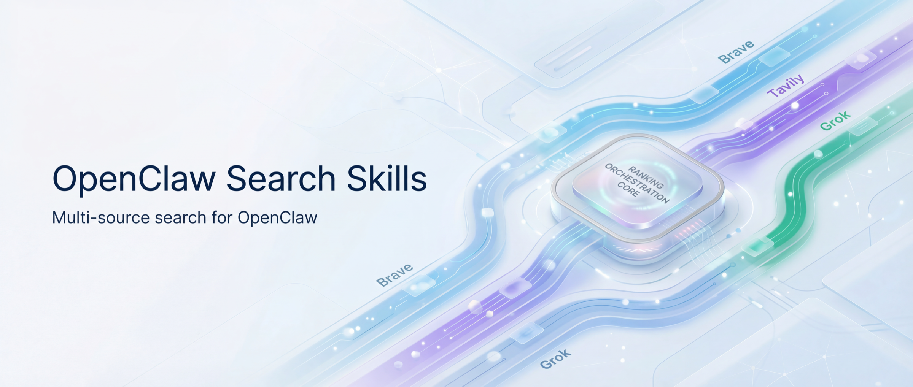

<div align="center">

# OpenClaw Search Skills

[English](./docs/README_EN.md) | 简体中文

**为 OpenClaw 提供多源搜索、线程深抓与高保真内容提取的一组生产级 Skills。**

[](https://github.com/openclaw/openclaw)
[](https://www.python.org/downloads/)
[](./LICENSE)
[](./search-layer/SKILL.md)
[](./content-extract/SKILL.md)

</div>

> 📦 本仓库已收录至 [openclaw-skills](https://github.com/blessonism/openclaw-skills)（聚合仓库，包含更多 Skills）。推荐 Star 聚合仓库以获取全部更新。

---

## 概述

`openclaw-search-skills` 是一组面向 [OpenClaw](https://github.com/openclaw/openclaw) Agent 的可组合搜索能力集合，覆盖从 **找资料**、**抓上下文**、**提正文** 到 **追引用链** 的完整链路。

## 包含什么

| Skill | 干什么的 |
|-------|---------| 
| **[search-layer](./search-layer/)** | 四源并行搜索（Brave + Exa + Tavily + Grok）+ 意图感知评分 + 自动去重 + 链式引用追踪。Brave 由 OpenClaw 内置的 `web_search` 提供，Grok 通过 Completions API 调用。 |
| **[content-extract](./content-extract/)** | URL → 干净的 Markdown。遇到反爬站点（微信、知乎）自动降级到 MinerU 解析。 |
| **[mineru-extract](./mineru-extract/)** | [MinerU](https://mineru.net) 官方 API 的封装层。把 PDF、Office 文档、HTML 页面转成 Markdown。 |

## 它们之间的关系

```
github-explorer（独立 repo）
├── search-layer ──── Exa + Tavily + Grok 并行搜索 + 意图评分 + 链式追踪   ← 本仓库
├── content-extract ── 智能 URL → Markdown                                  ← 本仓库
│   └── mineru-extract ── MinerU API（反爬）                                ← 本仓库
└── OpenClaw 内置工具 ── web_search (Brave), web_fetch, browser
```

---

## Search Skills 特性

- **四源并行搜索**：Brave + Exa + Tavily + Grok，覆盖普通网页、技术资料、实时信息与权威来源
- **意图感知检索**：按 `factual / status / comparison / tutorial / exploratory / news / resource` 自动切换策略，而不是一把梭搜索
- **Research lane**：深度调研可追加 research-light 增强
- **链式引用追踪**：遇到 GitHub issue / PR、HN、Reddit、V2EX 或网页文章时，可继续沿引用链深挖，而不只停留在首层结果
- **内容提取能力**：普通网页直接抽取 Markdown；反爬页面用 MinerU 抓取

## search-layer：能力主线

1. **Retrieval path**：面向绝大多数普通搜索请求的主路径
2. **Thread-pulling path**：面向 GitHub / 论坛 / 帖子深挖的追踪路径

两条路径共享同一个目标：**先把信息找对，再决定要不要继续往下挖**。

### 1. Retrieval path（默认主路径）

默认情况下，search-layer 负责多源召回、去重、排序与合成：

- Brave（由 OpenClaw 内置 `web_search` 提供）
- Exa
- Tavily
- Grok

其中 `search.py` 负责 Exa / Tavily / Grok 这条 API 检索链路，核心职责是：

- 按意图分类决定检索策略
- 生成并执行多 query bundle
- 融合多个搜索源结果
- 按 freshness / authority / keyword 做统一评分
- 保持 `results` contract 稳定

### Exa 在 retrieval path 中的角色

Exa 在默认主路径中的定位是：**提升基础检索质量的 retrieval source**，而不是直接把 search-layer 推成重型 research engine。

当前默认能力：

- **intent-aware type 路由**
  - `resource` → `instant`
  - `status` / `news` → `fast`
  - `exploratory` + `mode=deep` → `deep`
  - 其他 → `auto`
- **默认请求 highlights**：自动传 `contents.highlights.maxCharacters=1200`
- **时间窗口对齐**：`--freshness pd/pw/pm/py` 会映射到 Exa `startPublishedDate`
- **摘要质量增强**：本地优先使用 `highlights -> text -> summary -> snippet` 构造摘要，避免 Exa 因空摘要在 ranking 中被低估
- **结果可观测性**：在结果 metadata 中保留 `meta.exaType`（Exa 实际 resolved type）

### 2. Research lane

对于少数明显带有研究性质的查询，search-layer 会在标准召回与排序之后，追加一段 **research-light** 增强流程。

- 先走现有标准候选召回 + 评分排序
- 再追加一段 Exa `type=deep` 的第二阶段增强
- 通过可选 `research` block 输出
- **不替代 `results`**，只做附加增强

#### 当前触发边界（P1.5）

- **comparison**：显式对比词（`vs` / `区别` / `对比`）或 判断词（`should` / `值不值得` / `推荐`）或 3+ 子查询 → 触发
- **exploratory**：判断词 或 因果词（`why` / `为什么` / `影响`）或 对比词 → 触发；单纯宽泛主题词（如“生态”）不触发
- **status/news**：判断词 或 因果词 → 触发；单纯时效性或普通多查询扩展不触发
- **resource / tutorial / factual / answer mode**：默认不触发

### 3. Thread-pulling path（深度追踪路径）

当普通搜索结果里出现 GitHub issue / PR、论坛帖子、评论线程等“线索节点”时，search-layer 不会只停留在首层结果，而是可以继续沿引用链深挖。

- **查 GitHub 问题时**：不只看到 issue 标题，还能继续读正文、评论、关联 PR、交叉引用和 commit 线索
- **查社区讨论时**：不只拿到一个 HN / Reddit / V2EX 链接，而是能继续拿到帖子正文与关键回复
- **查网页文章时**：不只保留链接本身，还能提取正文和内部/外部引用，方便继续追踪
- **做根因分析时**：可以顺着“谁引用了谁、修复落在哪、讨论后来怎么演变”继续往下走，而不是停在第一层搜索结果

当前支持的平台包括：

- GitHub Issue / PR
- Hacker News
- Reddit
- V2EX
- 通用网页

#### 怎么用

```bash
# 搜索 + 自动提取引用
python3 search-layer/scripts/search.py "OpenClaw config validation bug" \
  --mode deep --intent status --extract-refs

# 跳过搜索，直接对已知 URL 提取引用
python3 search-layer/scripts/search.py --extract-refs-urls \
  "https://github.com/owner/repo/issues/123" \
  "https://github.com/owner/repo/issues/456"

# 直接深抓单个 thread / 页面
python3 search-layer/scripts/fetch_thread.py "https://github.com/owner/repo/issues/123"
python3 search-layer/scripts/fetch_thread.py "https://news.ycombinator.com/item?id=43197966"
python3 search-layer/scripts/fetch_thread.py "https://example.com/blog/post"
```

#### 工作流

```text
1. 先用 search.py 找到线索
2. 对结果做 extract-refs，拿到引用图
3. 选出高价值节点继续深抓
4. 沿引用链继续追，直到拿到完整上下文或找到根因
```

### 输出结果（用户视角）

Thread-pulling 能够让你稳定拿到的不是不只是一个链接，而是一份可继续分析、可继续追踪的上下文材料：

- 页面 / 讨论的正文
- 评论或回复
- 提到的引用关系（issue / PR / commit / 外部链接）
- 可继续追踪的链接线索

如果你需要看精确字段，直接运行 `fetch_thread.py` 或 `search.py --extract-refs` 查看输出即可。


---

## 安装

### 方式一：让 OpenClaw 帮你装（推荐 🚀）

直接在对话里告诉你的 OpenClaw agent：

> 帮我安装这个 skill：https://github.com/blessonism/openclaw-search-skills

### 方式二：手动安装

```bash
# 1. Clone 到任意位置
mkdir -p ~/.openclaw/workspace/_repos
git clone https://github.com/blessonism/openclaw-search-skills.git \
  ~/.openclaw/workspace/_repos/openclaw-search-skills

# 2. 链接到你的 skills 目录
cd ~/.openclaw/workspace/skills

ln -s ~/.openclaw/workspace/_repos/openclaw-search-skills/search-layer search-layer
ln -s ~/.openclaw/workspace/_repos/openclaw-search-skills/content-extract content-extract
ln -s ~/.openclaw/workspace/_repos/openclaw-search-skills/mineru-extract mineru-extract
```

> 💡 skills 目录因安装方式不同可能不同，常见的是 `~/.openclaw/workspace/skills/` 或 `~/.openclaw/skills/`。

---

## 配置

### 搜索 API Keys（search-layer 需要）

**方式一：Credentials 文件（推荐）**

创建 `~/.openclaw/credentials/search.json`：

```json
{
  "exa": "your-exa-key",
  "tavily": "your-tavily-key",
  "grok": {
    "apiUrl": "https://api.x.ai/v1",
    "apiKey": "your-grok-key",
    "model": "grok-4.1-fast"
  }
}
```

> 💡 Grok 配置可选。缺失时自动降级为 Exa + Tavily 双源。

**方式二：环境变量（兼容）**

```bash
export EXA_API_KEY="your-exa-key"        # https://exa.ai
# 可选：自定义 Exa 端点（用于自建/代理 Exa）。二选一即可
export EXA_API_BASE="https://exa.example.com"     # 会自动拼接 /search
export EXA_API_URL="https://exa.example.com/search"

export TAVILY_API_KEY="your-tavily-key"  # https://tavily.com
export GROK_API_URL="https://api.x.ai/v1"  # 可选
export GROK_API_KEY="your-grok-key"      # 可选
export GROK_MODEL="grok-4.1-fast"        # 可选，默认 grok-4.1-fast
```

环境变量会覆盖 credentials 文件中的同名配置。

**可选：自定义 Exa API 端点（用于自建/代理 Exa）**

默认 Exa 端点为 `https://api.exa.ai/search`。

你可以通过以下任一方式覆盖：

- 环境变量：`EXA_API_BASE="https://exa.example.com"`（自动拼接 `/search`）或 `EXA_API_URL="https://exa.example.com/search"`
- Credentials：在 `~/.openclaw/credentials/search.json` 里增加一项，例如：

```json
{
  "exa": "your-exa-key",
  "exaApiBase": "https://exa.example.com"
}
```

（也支持把 `exa` 写成对象：`{"exa": {"apiKey": "...", "apiUrl": "https://exa.example.com"}}`）

Brave API Key 由 OpenClaw 内置的 `web_search` 工具管理，不需要在这里配置。

### MinerU Token（可选，content-extract 需要）

只有当你需要抓取微信/知乎/小红书等反爬站点时才需要：

```bash
cp mineru-extract/.env.example mineru-extract/.env
# 编辑 .env，填入你的 MinerU token（从 https://mineru.net/apiManage 获取）
```

### Python 依赖

```bash
# 基础依赖（search-layer v2.x）
pip install requests

# v3.0 链式追踪新增依赖
pip install trafilatura beautifulsoup4 lxml
```

---

## 近期演化（changelog）

### search-layer v3.0 特性

v3.0 新增 **Thread-pulling path**，让 search-layer 从“返回搜索结果”升级为“沿引用链继续深挖上下文”：

- 新增 `fetch_thread.py`，支持 GitHub Issue / PR、Hacker News、Reddit、V2EX、通用网页的结构化深抓
- `search.py` 支持 `--extract-refs` / `--extract-refs-urls`，可以从搜索结果直接进入引用追踪
- 适合 GitHub issue 调研、社区讨论梳理、根因分析、workaround 追踪等场景
- 目标不是多几个内部脚本，而是让 agent 能从“找到链接”继续走到“拿到完整上下文”

### search-layer v2.2 特性

v2.2 增强了 Grok 源的稳定性，新增源过滤功能：

- **源过滤**：`--source grok,exa` 指定只使用特定搜索源，方便测试和对比
- **默认模型升级**：Grok 默认模型从 `grok-4.1` 切换到 `grok-4.1-fast`（更快更稳定）
- **Thinking 标签处理**：自动剥离 Grok thinking 模型的 `<think>` 标签
- **JSON 提取增强**：处理 Grok 在 JSON 前输出自然语言文字的情况（`raw_decode` + `rfind` fallback）
- **Credentials 文件**：统一凭据管理，`~/.openclaw/credentials/search.json` 集中存放所有搜索源 key

### search-layer v2.1 特性

v2.1 新增 **Grok (xAI)** 作为第四搜索源，通过 Completions API 调用，支持 API 代理站：

- **Grok 搜索源**：利用 Grok 模型的实时知识返回结构化搜索结果，擅长时效性查询和权威源识别
- **四源并行**：Deep 模式下 Exa + Tavily + Grok 三源并行（加上 agent 层的 Brave 共四源）
- **智能降级**：Grok 配置缺失时自动降级为 Exa + Tavily 双源，不影响现有流程
- **SSE 兼容**：自动检测并处理 API 代理强制 stream 的情况
- **安全加固**：查询注入防护（`<query>` 标签隔离）、URL scheme 验证（仅 http/https）
- **日期提取**：Grok 结果包含 `published_date`，参与新鲜度评分

### search-layer v2 特性

v2 借鉴了 [Anthropic knowledge-work-plugins](https://github.com/anthropics/knowledge-work-plugins) 的 enterprise-search 设计，新增：

- **意图分类**：7 种查询意图（factual / status / comparison / tutorial / exploratory / news / resource），自动调整搜索策略和评分权重
- **多查询并行**：`--queries "q1" "q2" "q3"` 同时执行多个子查询
- **意图感知评分**：`score = w_keyword × keyword_match + w_freshness × freshness_score + w_authority × authority_score`，权重由意图类型决定
- **域名权威性评分**：内置四级域名评分表（60+ 域名 + 模式匹配规则）
- **Freshness 过滤**：`--freshness pd/pw/pm/py` 实际传递给 Tavily
- **Domain Boost**：`--domain-boost github.com,stackoverflow.com` 提升特定域名权重
- **完全向后兼容**：不带新参数时行为与 v1 一致

---

## 使用示例

### search-layer

```bash
# 基础搜索（v1 兼容模式）
python3 search-layer/scripts/search.py "RAG framework comparison" --mode deep --num 5

# 意图感知模式（v2+）
python3 search-layer/scripts/search.py "RAG framework comparison" --mode deep --intent exploratory --num 5

# 多查询并行
python3 search-layer/scripts/search.py --queries "Bun vs Deno" "Bun advantages" "Deno advantages" \
  --mode deep --intent comparison --num 5

# 最新动态 + 时间过滤
python3 search-layer/scripts/search.py "Deno 2.0 latest" --mode deep --intent status --freshness pw

# 单源测试
python3 search-layer/scripts/search.py "OpenAI latest news" --mode deep --source grok --num 5

# 搜索 + 链式追踪（v3.0）
python3 search-layer/scripts/search.py "OpenClaw config bug" --mode deep --intent status --extract-refs
```

模式：`fast`（Exa 优先）、`deep`（Exa + Tavily + Grok 并行）、`answer`（Tavily 带 AI 摘要）

意图：`factual`、`status`、`comparison`、`tutorial`、`exploratory`、`news`、`resource`

### fetch_thread.py（v3.0 新增）

```bash
# GitHub issue / PR
python3 search-layer/scripts/fetch_thread.py "https://github.com/owner/repo/issues/123"
python3 search-layer/scripts/fetch_thread.py "https://github.com/owner/repo/pull/456" --format markdown

# 仅提取引用（快速）
python3 search-layer/scripts/fetch_thread.py "https://github.com/owner/repo/issues/123" --extract-refs-only

# HN / Reddit / V2EX / 任意网页
python3 search-layer/scripts/fetch_thread.py "https://news.ycombinator.com/item?id=43197966"
python3 search-layer/scripts/fetch_thread.py "https://www.reddit.com/r/Python/comments/abc123/title/"
```

### content-extract

```bash
python3 content-extract/scripts/content_extract.py --url "https://mp.weixin.qq.com/s/some-article"
```

### mineru-extract

```bash
python3 mineru-extract/scripts/mineru_extract.py "https://example.com/paper.pdf" --model pipeline --print
```

---


## 环境要求

- [OpenClaw](https://github.com/openclaw/openclaw)（agent 运行时）
- Python 3.10+
- `requests`（基础依赖）
- `trafilatura`、`beautifulsoup4`、`lxml`（v3.0 链式追踪依赖）
- API Keys：Exa 和/或 Tavily（search-layer），Grok API（可选，第四搜索源），MinerU token（可选，content-extract）

## License

MIT
